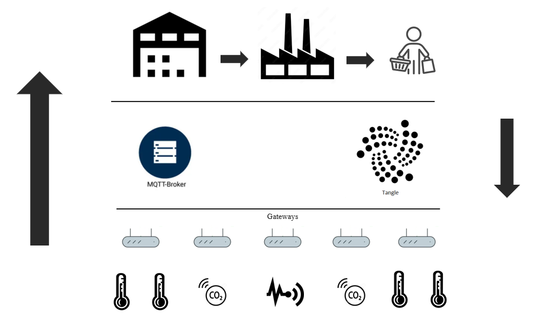
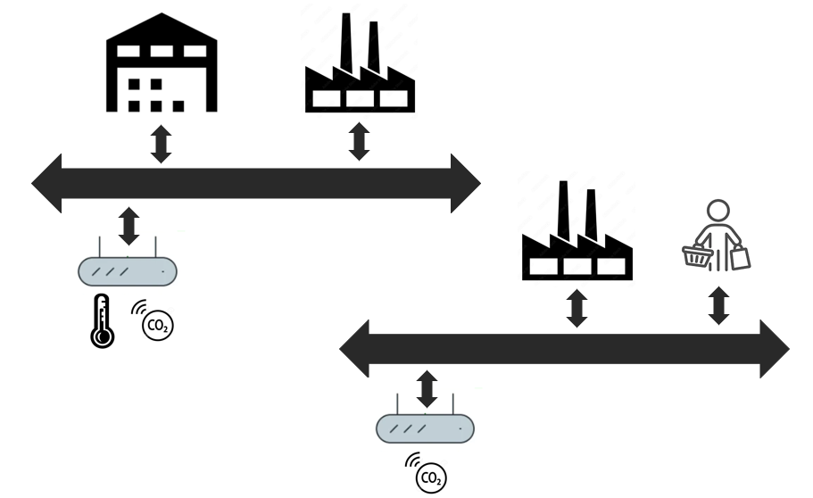

# iota-iiot-communication

## Description

IIoT system using MQTT, IOTA Streams, and Identity. 





## Installation

```
Tested on:
- IOTA Identity v0.5.0-dev.4, commit=4b6c1c7
- IOTA Streams v0.1.2, commit=4e3a2c8
- rustc v1.56.1
- cargo v1.56.0
- cross v1.56.0
- docker v20.10.12
- Linux Ubuntu 20.04 LTS / Ubuntu 21.10
```

## Run

Use Docker to run individual participants. 
Instructions in folder docker.
